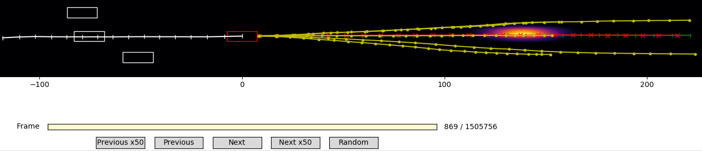

# Convolutional Social Pooling with Spatial Attention

CS230 Project Code based on [1] Nachiket Deo and Mohan M. Trivedi,"Convolutional Social Pooling for Vehicle Trajectory Prediction." CVPRW, 2018

The code from on [1]  is used as a baseline and starting point for further code evolutions and experiments with seq2seq, attention and transformer models.


[//]: # (Image References)
[image1]: ./visu.png

<p align="center">
     
     <br>Probabilistic and Multimodal Trajectory Predictions
</p>

### Dependencies

We recommend using python3. You may find convenient to use a virtual env.

```bash
virtualenv -p python3 .env
source .env/bin/activate
pip install -r requirements.txt
```

When you're done working on the project, deactivate the virtual environment with ```deactivate```.


# Dataset Preprocessing

### NGSIM dataset
  
From NGSIM website:  
* Register at https://data.transportation.gov/Automobiles/Next-Generation-Simulation-NGSIM-Vehicle-Trajector/8ect-6jqj  
* Download US-101-LosAngeles-CA.zip and I-80-Emeryville-CA.zip  
* Unzip and extract vehicle-trajectory-data into raw/us-101 and raw/i-80  
  
From googledrive:  
* Download i-80: https://drive.google.com/open?id=19ovxiJLCnS1ar1dYvUIrfdz_UnGejK-k  
* Download us-101: https://drive.google.com/open?id=14dMKew22_5evfOoSGEBYqHP3L92e7nyJ  
  

### Reference .mat files
Obtained with preprocess_data.m (legacy) or preprocess_data_faster.m (much faster) applied to above NGSIM dataset    
https://drive.google.com/open?id=1xxAmnsn_sROUjvJiNWetCQ7odLNFA_Zt  

# Running experiments

### Training  

Using a GPU is highly recommended due to the huge speedup.
```bash
python train.py --experiment baseline
```
Or to continue training  
```bash
python train.py --experiment baseline --restore_file best
```

To train enhanced version of Transformer:
```bash
python train.py --experiment transformerX
```
By default the batch_size is set to 1024, and will use close to 16GB of GPU memory. 
You may have to adapt the batch size in params.json for your setup. Generally for Transformer try to use a batch size as big as you can (cf https://arxiv.org/abs/1804.00247), while with RNN-LSTM we usually stick to 128.

### Evaluating 

```bash
python evaluate.py --experiment baseline
```

### RMSE results on NGSIM test set

The best results are obtained with an enhanced version of the baseline. We call it CSSA-LSTM(M)  

| Time (sec) | CV        | CS-LSTM(M) | seq2seq   |Transformer | CSSA-LSTM(M)|
|:----------:|:---------:|:----------:|:---------:|:----------:|:-----------:|
|      1     |   0.73    |    0.58    |    0.59   |    0.52    |   0.42      |
|      2     |   1.78    |    1.27    |    1.28   |    1.23    |   1.06      |
|      3     |   3.13    |    2.12    |    2.14   |    2.17    |   1.85      |
|      4     |   4.78    |    3.19    |    3.25   |    3.23    |   2.85      |
|      5     |   6.68    |    4.51    |    4.59   |    4.70    |   4.11      |

To replicate CSSA-LSTM(M) results:
* Preprocess NGSIM data: preprocess_dataX.m on raw/ text files from NGSIM
* Copy generated *.mat files into data/
* Train CSSA-LSM(M): python train.py --experiment baselineX
* Evaluate CSSA-LSM(M): python evaluate.py --experiment baselineX  


# Acknowledgements

Thank you to the authors of CS-LSTM(M) and Transformer for open-sourcing their work.   
This code is built on top of the 1st reference:
* https://github.com/nachiket92/conv-social-pooling/  
* https://github.com/tensorflow/tensor2tensor/blob/master/tensor2tensor/models/transformer.py  

Thank you to the HarvardNLP team for their great walkthrough of the Transformer paper.  
The transformer.py code is adapted and customized from here:
* http://nlp.seas.harvard.edu/2018/04/03/attention.html  
  
Thank you to mljack for open-sourcing a plotting utility.  
The plot.py code is adapted and customized from here:
* https://github.com/mljack/conv-social-pooling/blob/master/plot.py    
  
